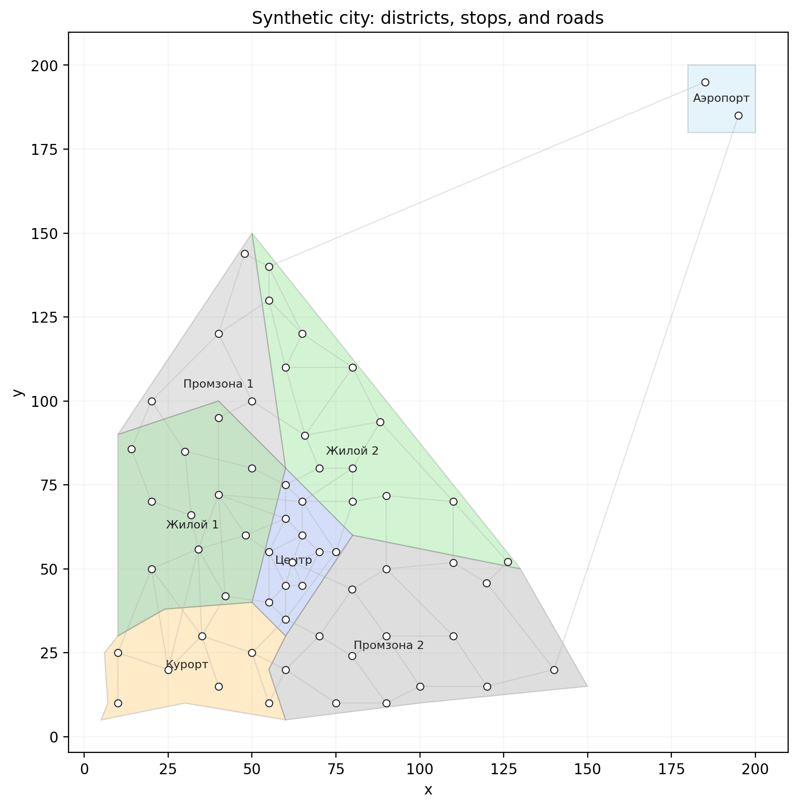
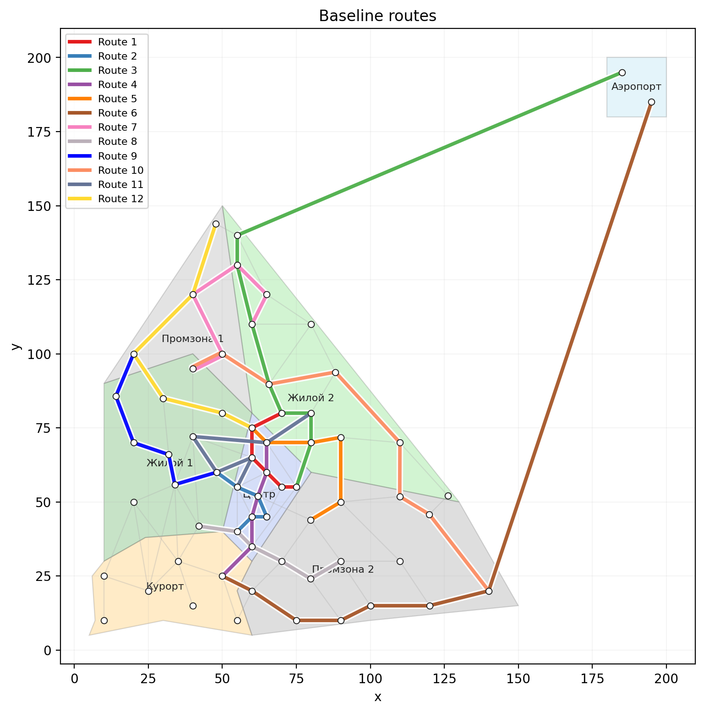
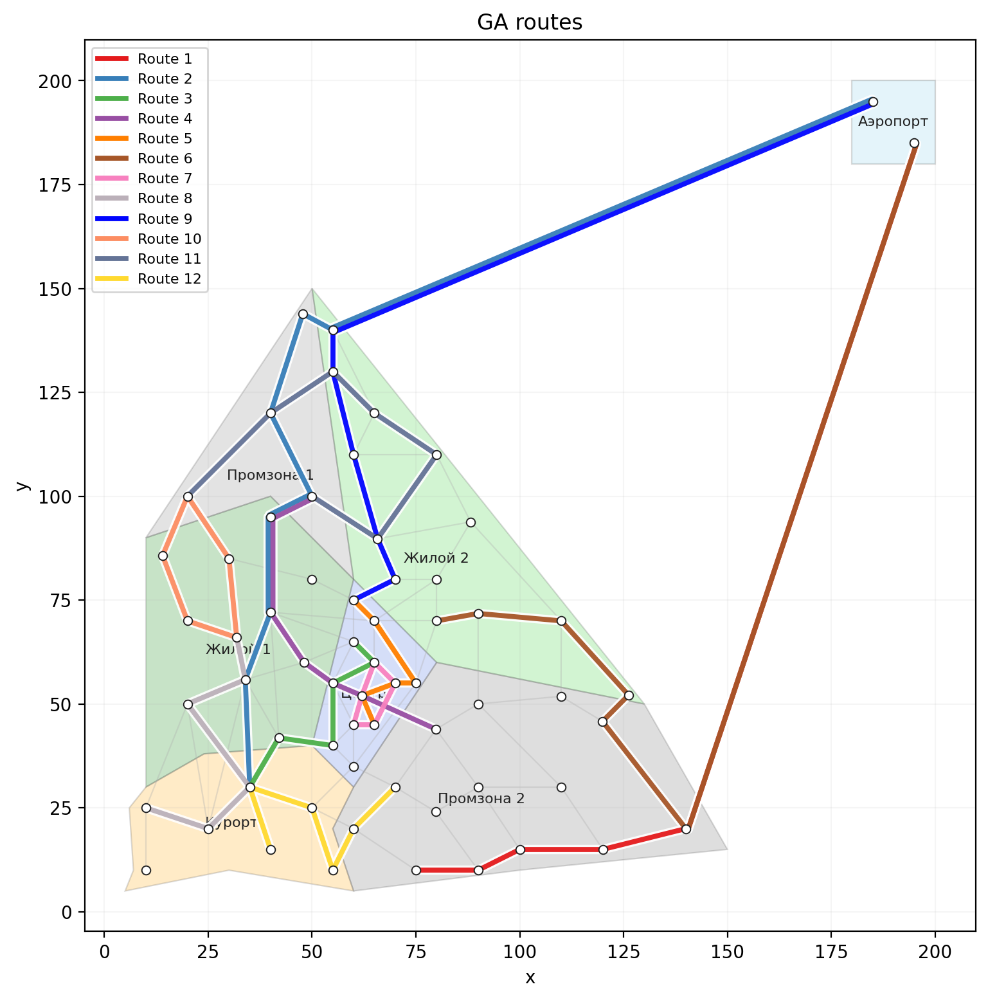
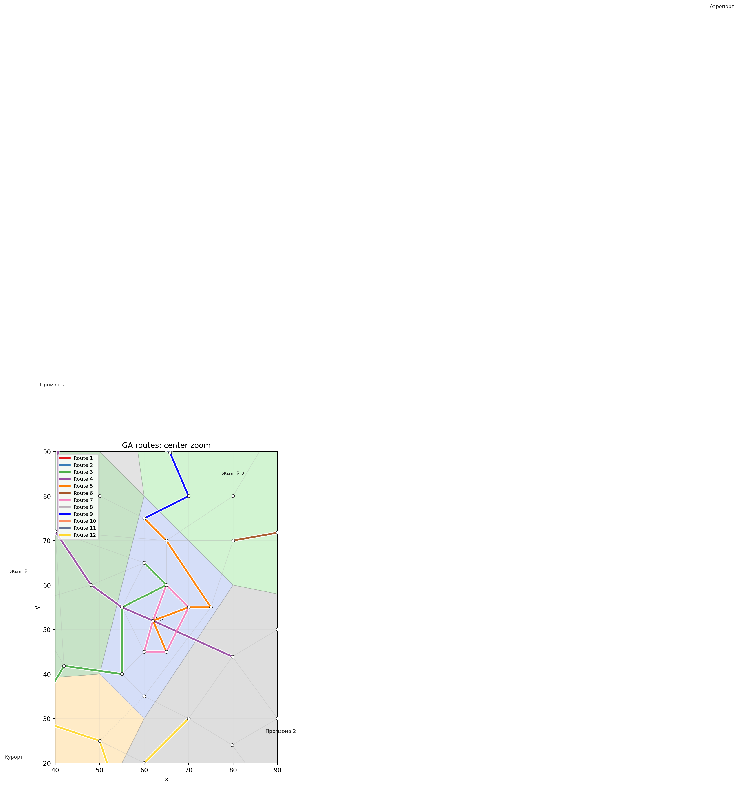
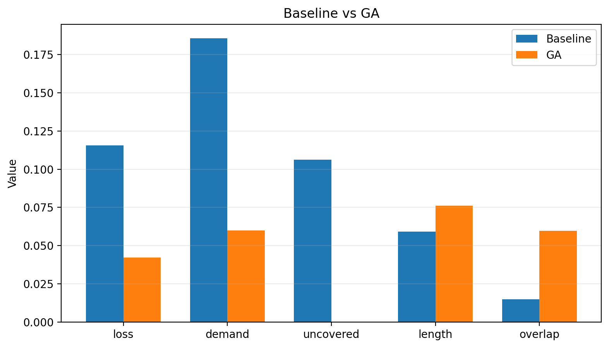

# Routio

Routio - экспериментальный Python-проект для построения и сравнения маршрутных сетей общественного транспорта на синтетическом графе города.

Проект использует районы, остановки, дороги и OD-матрицу пассажирского спроса, а затем строит маршрутные сети несколькими способами:

- baseline-методом на основе пар районов с высоким спросом и кратчайших путей;
- генетическим алгоритмом, который оптимизирует покрытие спроса, длину маршрутов, непокрытый спрос и пересечения маршрутов;
- опциональным LLM-экспериментом для сравнения маршрутов, предложенных языковой моделью.

На выходе формируются карты, графики и CSV-метрики, которые можно использовать в презентации или отчете.

## Превью

### Синтетический граф города



### Baseline-маршруты



### Маршруты генетического алгоритма



### Приближение центральной части



### Сравнение методов



## Структура проекта

```text
routio/
  main.py                 # основная точка запуска эксперимента
  data_input.py           # районы, остановки, дороги, OD-матрица, конфиг
  graph_utils.py          # построение и проверка графа
  metrics.py              # метрики маршрутной сети и компоненты objective-функции
  baseline.py             # построение baseline-маршрутов
  genetic_algorithm.py    # оптимизация маршрутной сети генетическим алгоритмом
  visualization.py        # построение карт и графиков
  experiment.py           # pipeline сравнения baseline и GA
  grid_search.py          # перебор параметров генетического алгоритма
  llm_experiment.py       # опциональный эксперимент с LLM-маршрутами
  outputs/                # выбранные визуальные результаты
```

## Установка

Нужен Python 3.12 или новее.

```bash
python -m venv .venv
.venv\Scripts\activate
pip install networkx matplotlib numpy
```

На macOS/Linux виртуальное окружение активируется так:

```bash
source .venv/bin/activate
```

## Запуск

Запустить основной эксперимент baseline vs GA:

```bash
python main.py
```

Запустить перебор параметров генетического алгоритма:

```bash
python grid_search.py
```

Запустить опциональное сравнение с LLM-маршрутами:

```bash
python llm_experiment.py
```

Все сгенерированные артефакты сохраняются в папку `outputs/`.

## Основные результаты

- `outputs/01_city_graph.png` - синтетический граф города с районами и остановками.
- `outputs/02_od_matrix_heatmap.png` - тепловая карта OD-матрицы спроса.
- `outputs/03_baseline_routes_colored.png` - маршрутная сеть baseline-метода.
- `outputs/04_ga_routes_colored.png` - маршрутная сеть, найденная генетическим алгоритмом.
- `outputs/05_baseline_edge_load.png` - загрузка ребер для baseline.
- `outputs/06_ga_edge_load.png` - загрузка ребер для GA.
- `outputs/07_ga_center_zoom_colored.png` - приближение центральной части для GA-маршрутов.
- `outputs/08_baseline_center_zoom_colored.png` - приближение центральной части для baseline.
- `outputs/09_ga_loss_history.png` - история изменения loss генетического алгоритма.
- `outputs/10_ga_components_history.png` - история компонентов objective-функции.
- `outputs/11_method_comparison.png` - сравнение метрик baseline и GA.


